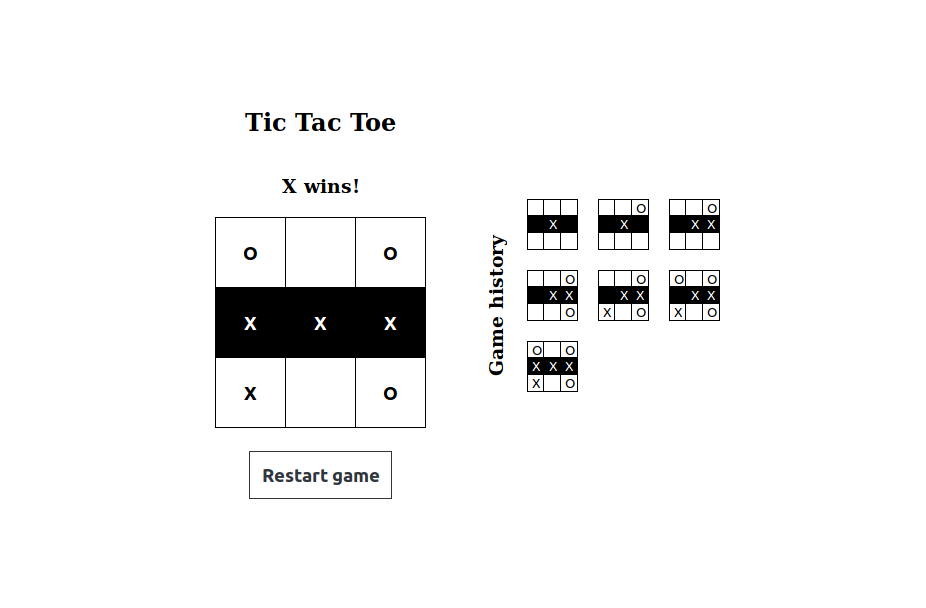

## React Tic Tac Toe

The first step in learning React.

### How it works?

In `src/index.1.js` the React tutorial from https://reactjs.org/tutorial/tutorial.html is implemented kinda copy-pasting the code from the website.

After that in `src/index.js` the tutorial is re-created from scratch, without checking the tutorial, by trying to use best practices like *component structure*, *documentation*, *styled components* and so on.

### First impressions

- It seems everything from the recommended ecosystem modules (styleguidist, styled components) is working out of the box. One year ago with Vue I had problems with all these.
- I like the incorporated best practices like pure components, immutability (so far) and perhaps higher order functions later.
- I like the simplicity and effectiveness in the React philosophy like `don’t spend more than five minutes on choosing a file structure`. Or https://reactjs.org/docs/thinking-in-react.html
- There are some *glitches* too at first sight, like not being able to use `for` in `render()`. In Vue we have `for`, `if` and so on.
- While Vue is focusing on nicer syntax and coding experience (single file components) React is focusing on writing the best code possible even if / which is often more slow and complicated at first, but pays off on the long run.
- Both Vue and React docs are very well done, but React is a step further, probably the best I've ever seen. The language is just so professional.

### Things learned

- In React, when refactoring or extending code, all you do is to lift state. Basically, on long term you'll always do lifting state.
- To make state lifting easy every function call should start with a set of variable declarations like:
```
renderSquare(i) {
	const squares = this.state.current.squares;
	const winningSquares = this.state.winningSquares;
	const isInteractive = this.state.isInteractive;
	const squareSize = this.state.squareSize;
```  
When this functionality is lifted from the current component to another all what one needs to do is just replace `this.state` with `this.props` and the refactoring is done.
- Debugging is a pain right now, maybe it will be better later.
- Styled components are handy. You never write something like `<section>` or `<ol>`. Instead you write something more semantic like `<SquaresContainer>` or `<Items>`. Completely skipping the usage of standard HTML elements it's like a revelation. They've never should be existed. It's like prescribing function names

Example:
```
<Container>
	<ContainerTitle>Game history</ContainerTitle>
	<Items>
		<Repeat numberOfTimes={stepNumber} startAt={1}>
			{(i) => this.renderItem(i)}
		</Repeat>
	</Items>
</Container>
```


## Todo

- Replace `index.js` from component folders with `package.json`
